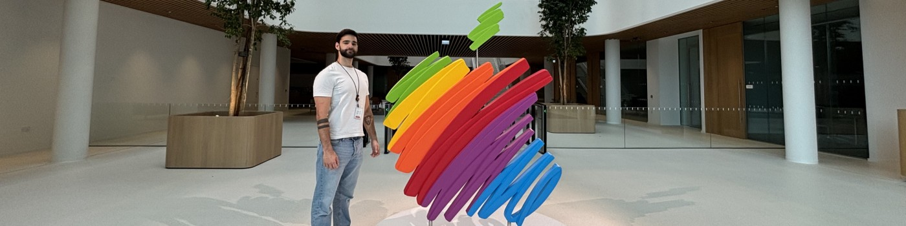
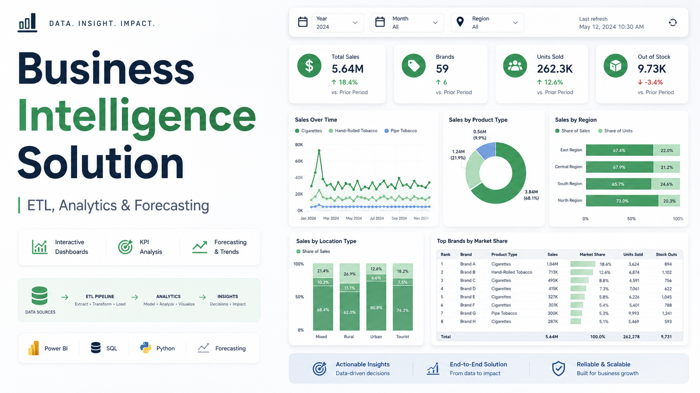
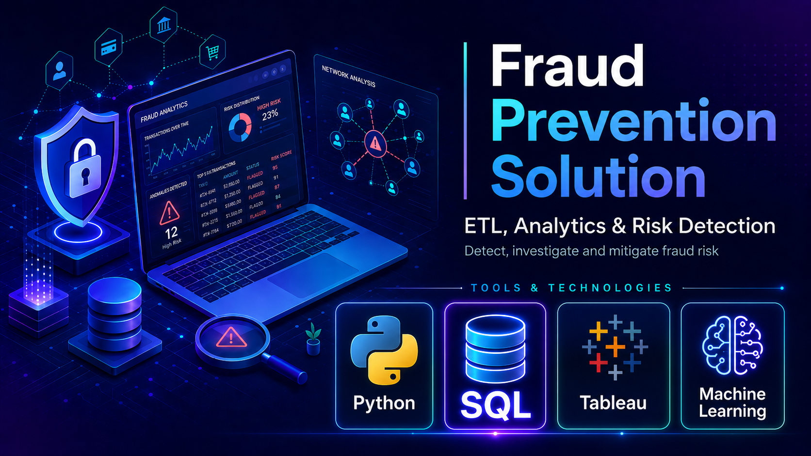

<h1 align="center">
  Hi, I am <a href="https://www.linkedin.com/in/joel-rivera-garmendia/">JOEL</a> 👋
</h1>

<h3 align="center">
  Business Intelligence & Data Analyst
</h3>

  📫 Reach me at
  <a href="https://mail.google.com/mail/?view=cm&fs=1&to=joelriveragar@gmail.com">
    <strong>joelriveragar@gmail.com</strong>
  </a>

  

<h2>Top Projects</h2>

<table width="100%" border="1" cellpadding="18" cellspacing="0">
  <tr>

<!-- PROJECT 1 -->

<td width="50%" valign="top" align="center">

<h3>
  Business Intelligence Solution: 
  ETL, Analytics and Forecasting
</h3>

  

 

  
  
  
  
  
  

 

  End-to-end Business Intelligence solution integrating operational and
  external data to analyse sales, logistics, product availability and
  business performance through interactive dashboards.

  

</td>

<!-- PROJECT 2 -->

<td width="50%" align="center" valign="top">

  <h3>
    Fraud Prevention Solution
  </h3>

  

    

  

    
    &nbsp;
    
    &nbsp;
    
    &nbsp;
    
  

  

    End-to-end fraud analytics project using SQL, Python, Tableau and
    machine learning to investigate suspicious transaction patterns,
    develop risk indicators and support fraud-monitoring decisions.
  

  

    
  

</td>

---

## About me

- 📊 Business Intelligence and Data Analysis professional based in Ireland
- 🍎 Apple
- 🎓 Master's in Business Intelligence and Data Analysis
- 📚 Bachelor's degree in Business Administration and Management, Finance
- 🌍 Languages: Spanish, English and Basque
- 📈 Focused on transforming complex datasets into actionable business insights
- 🔍 Interested in Data Analyst, BI Analyst and Business Analyst opportunities

---

## Tools and technologies

### Data analysis and programming

### Business Intelligence and visualisation

### Business systems

---

## 📫 Connect with me

---
